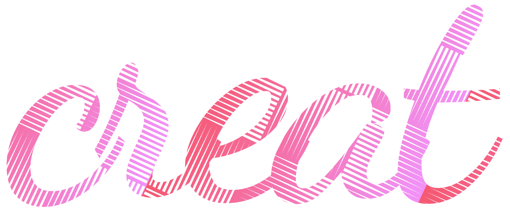

  
  <h3>为思维发散和协同讨论孕育而生的白板应用 由2022年七牛云1024创作节诞生的产品 
  </h3>
  
 欢迎大家提出问题 <a target="_blank" href="https://github.com/uiuing/creat/issues">https://github.com/uiuing/creat/issues</a>.

## 快速体验

线上地址: [https://creat.uiuing.com](https://creat.uiuing.com)

查看更新: [https://github.com/uiuing/creat](https://github.com/uiuing/creat)

## 产品定位

### 第二大脑
将我们视为一个协作白板，不如将我们视为第二大脑, 在白板中你可以任意表达自己的想法.

### 场景扩展

我们不受传统的文档编辑器的限制，我们可以在任意位置新建图形，文字，甚至是代码.

### 社区插件

通过将素材库的添加暴露，我们可以将白板按照自己的需求进行扩展,每一个人都可以定制化不同于别人的应用.

### 会议协同

通过在线参加会议的形式，我们可以将白板的内容进行分享，无论你身处何方.

## 主要功能

* 白板管理（进入、删除、重命名、最近打开）
* 创建白板/加入会议/创建会议
* 图形选择菜单
* 图形配置菜单
* 白板状态菜单
* 右键菜单
* 会议状态管理
* 协作鼠标同步（后续加入）
* 素材库（后续加入）
